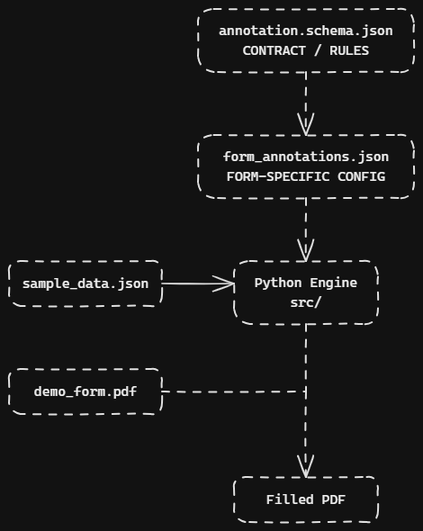
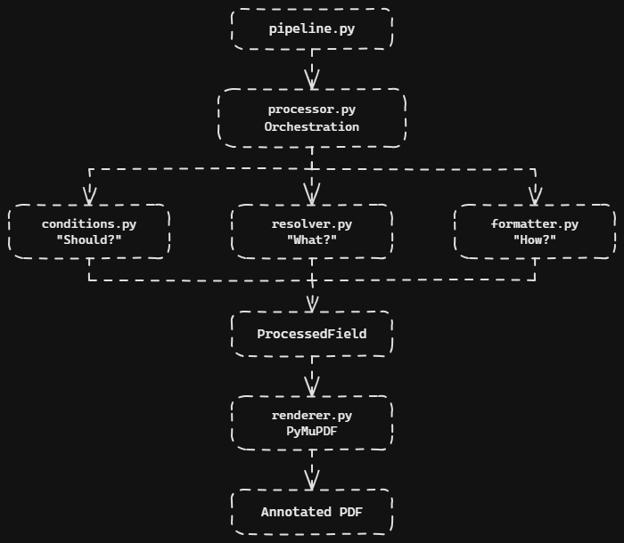

# Tax Form Annotation Specification & Reference Pipeline

A declarative, language-independent specification and Python reference implementation for resolving structured JSON data, evaluating conditional visibility, formatting values, and rendering fields onto PDF form templates.

---

## 1. Project Overview

Filling structured forms programmatically often leads to tight coupling between business data models, form layouts, and rendering engines.

This project establishes a **JSON-based declarative annotation contract** that decouples:
* **What** value to extract using a restricted JSONPath subset.
* **When** to render it using conditional evaluation rules.
* **How** to format it (text, currency, percentage, date, etc.).
* **Where** to place it using explicit PDF point bounding boxes.
* **How** to style it (font size, text alignment).

The JSON Schema is the authoritative, platform-agnostic contract. The accompanying Python codebase provides a reference implementation capable of processing any document matching the contract.

---

## 2. Problem Being Solved

Tax forms and governmental documents are rigid visual grid layouts with strict spatial and presentation requirements. Hardcoding coordinate logic into backend code creates brittle pipelines that break across form revisions, multilingual adaptations, and different backend languages.

This specification decouples **form layout metadata** from the **execution engine**. The backend simply supplies raw data, the template supplies visual assets, and the annotation document supplies the declarative binding layer.

---

## 3. High-Level Architecture



### Schema vs. Form Annotation Relationship

* **`annotation.schema.json`**: The contract and rulebook. It defines valid syntax, supported types, coordinate bounds, and validation constraints. It does not contain any form-specific layout data.
* **`form_annotations.json`**: A concrete instance of the contract for a specific form and revision (e.g., a generic tax document). Different forms or tax years require only new annotation JSON documents—the underlying engine remains unchanged.

### Component Breakdown

* **`src/models.py`**: Pydantic v2 models validating documents against the schema with closed-model boundaries (`extra="forbid"`) and document-level ID uniqueness checks.
* **`src/resolver.py`**: A zero-dependency resolver for extracting values from nested dictionaries and arrays using a restricted JSONPath subset.
* **`src/conditions.py`**: Evaluates comparison operations against resolved data to determine field visibility.
* **`src/formatter.py`**: Converts raw Python primitives into formatted strings using fixed-point `Decimal` arithmetic.
* **`src/processor.py`**: Merges document-level defaults with field-level overrides, resolving data and evaluating conditions into an intermediate `ProcessedField`.
* **`src/renderer.py`**: Uses PyMuPDF to place `ProcessedField` text strings into target PDF bounding boxes.
* **`src/pipeline.py`**: Coordinates document-level execution from raw input to the final PDF.

---

## 4. Processing Pipeline



The internal pipeline processes each annotation field through isolated stages:

1. **Annotation Processing (`processor.py`)**: Orchestrates the processing of an individual annotation, including condition evaluation, data resolution, default merging, and formatting.
2. **Visibility Check (`conditions.py`)**: Determines *"Should this field render?"*. If `False`, processing halts immediately and the field is marked as skipped.
3. **Data Extraction (`resolver.py`)**: Resolves *"What value to extract?"* from the input JSON using the field's path expression.
4. **Display Formatting (`formatter.py`)**: Determines *"How should it display?"*, applying currency symbols, decimal precision, or date formatting.
5. **Contract Handoff (`ProcessedField`)**: Packages the resolved value, geometry, and style properties into a render-ready model.
6. **Document Orchestration (`pipeline.py`)**: Applies annotation processing across the document and passes the resulting fields to the renderer.
7. **PDF Placement (`renderer.py`)**: Places the final formatted values into the target PDF bounding boxes.

---
## 5. Project Structure

```
tax-annotation-spec/
├── .gitignore
├── README.md
├── pyproject.toml
├── schema/
│   └── annotation.schema.json
├── examples/
│   ├── demo_form.pdf
│   ├── form_annotations.json
│   ├── render_demo.py
│   └── sample_data.json
└── src/
    ├── __init__.py
    ├── conditions.py
    ├── formatter.py
    ├── models.py
    ├── pipeline.py
    ├── processor.py
    ├── renderer.py
    └── resolver.py
```

---

## 6. Annotation Schema & Top-Level Structure

The JSON Schema Draft 2020-12 contract (`schema/annotation.schema.json`) defines five mandatory top-level properties:

```json
{
  "schema_version": "1.0",
  "form": {
    "id": "GENERIC-TAX-01",
    "tax_year": 2025,
    "revision": "v1.0"
  },
  "coordinate_system": {
    "unit": "pt",
    "origin": "top-left"
  },
  "defaults": {
    "format": { "type": "text" },
    "style": { "font_size": 10.0, "alignment": "left" }
  },
  "annotations": [
    {
      "id": "taxpayer_name",
      "label": "Taxpayer Name",
      "source": "$.taxpayer.first_name",
      "required": true,
      "target": {
        "page": 1,
        "box": { "x": 220.0, "y": 140.0, "width": 250.0, "height": 18.0 }
      }
    }
  ]
}
```

---

## 7. Supported JSONPath Subset

To guarantee deterministic execution and cross-language compatibility, the resolver implements a secure, restricted path grammar:

* **Root**: `$`
* **Object Properties**: `$.taxpayer` or `$.taxpayer.income.wages`
* **Zero-based Array Indices**: `$.dependents[0]` or `$.dependents[0].name`
* **Identifier Rules**: Property names must begin with a letter or underscore, followed by alphanumeric characters or underscores.
* **Unsupported by design**: Wildcards (`*`), recursive descent (`..`), slices (`[:]`), filter expressions (`[?()]`), and embedded scripts.

---

## 8. Conditional Rendering

Field visibility is controlled via an optional `condition` object:

* **Supported Operators**: `equals`, `not_equals`, `greater_than`, `greater_than_or_equal`, `less_than`, `less_than_or_equal`.
* **Short-Circuit Evaluation**: Conditions are evaluated before source resolution. If a condition evaluates to `False`, the engine skips resolution, avoiding missing-property errors on optional fields.
* **Safe Missing Fallback**: If a path referenced by a visibility condition does not exist in the source payload, the condition evaluates safely to `False`.

---

## 9. Value Formatting

The formatter converts raw data primitives into presentation-ready strings using Python's `Decimal` module:

| Format Type | Behavior & Defaults | Example Input | Formatted Output |
|---|---|---|---|
| `text` | Direct string output; rejects complex containers | `"Jane"` | `"Jane"` |
| `integer` | Thousands separators; rejects non-integral floats | `115000` | `"115,000"` |
| `decimal` | Fixed precision; defaults to `decimal_places: 2` | `1234.5` | `"1,234.50"` |
| `currency` | Currency symbols + separators; defaults to USD, 2 decimals | `115000` | `"$115,000.00"` |
| `percentage` | Fractional input multiplied by 100; defaults to 2 decimals | `0.15` | `"15.00%"` |
| `date` | Parses ISO 8601 strings; defaults to `date_format: "%m/%d/%Y"` | `"2025-04-15"` | `"04/15/2025"` |

Booleans are strictly guarded to prevent implicit casting to numbers.

---

## 10. Positioning & Coordinate System

* **Units**: PDF Points (pt), where 72 pt = 1 inch.
* **Origin**: top-left (0,0) located at the upper-left corner of each page (+X rightward, +Y downward).
* **Bounding Box**: Rectangular region defined by `x`, `y`, `width` (> 0), and `height` (> 0).
* **Page Indexing**: Annotations use 1-based indexing (`page: 1` maps to PDF index 0).

---

## 11. Defaults and Single-Level Overrides

Document-level defaults provide fallback values for `format` and `style`:

* **Inheritance Model**: Single-level fallback. Properties explicitly defined on an annotation take precedence over matching document defaults.
* **Immutability**: Merging produces a new effective specification without mutating the original configuration objects.

---

## 12. PDF Rendering

* Uses PyMuPDF (`fitz`) as the single PDF manipulation library.
* Inserts text inside target bounding boxes using standard 14 fonts (Helvetica) ensuring consistent rendering across environments without external font asset dependencies.
* Preserves underlying template graphics, lines, and background elements.
* Supports left, center, and right text alignments.

---

## 13. Local Setup & End-to-End Demo

### Installation (Windows)

```
# 1. Create and activate a virtual environment
python -m venv .venv
.venv\Scripts\activate

# 2. Upgrade pip and install package dependencies
pip install --upgrade pip
pip install -e .
```

### Run the Demo Pipeline

```
python -m examples.render_demo
```

The demo executes the entire pipeline:
1. Validates `form_annotations.json` against the Pydantic domain models.
2. Loads structured input data from `sample_data.json`.
3. Creates the generic `demo_form.pdf` template if it does not already exist.
4. Processes the annotations through resolution, conditional evaluation, formatting, and rendering.
5. Writes the final annotated PDF to `output/annotated_demo.pdf`.

---

## 14. Design Decisions

* **Strict Declarative Contract**: Decouples data schemas from form layouts so form mappings can be authored as standard JSON without modifying the underlying execution engine.
* **Deterministic Path Traversal**: Omitting arbitrary JSONPath expressions ensures execution is predictable, lightweight, and language-portable.
* **Fixed-Point Arithmetic**: Formatter operations run through `Decimal` to avoid binary floating-point rounding artifacts.
* **Decoupled Renderer**: The PDF rendering module accepts only `ProcessedField` primitives and has no awareness of JSONPaths, conditions, or raw datasets.

---

## 15. Limitations & Future Enhancements

* **Dynamic Font Scaling**: Box boundaries currently use fixed font sizes; future versions could implement auto-shrinking text to fit restricted boundaries.
* **Custom Typography**: Support for custom embedded OTF/TTF fonts, text colors, and stroke weights.
* **Compound Logical Conditions**: Expanding single comparisons to include composite AND / OR condition blocks.